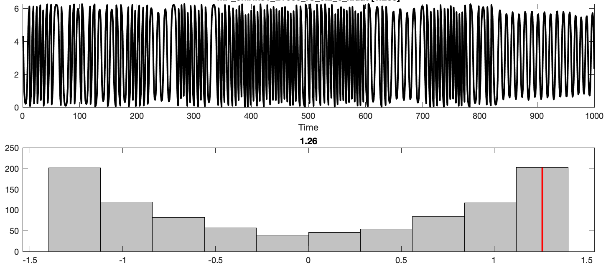

# The DN\_HistogramMode features

_catch22_ contains two features involving `DN_HistogramMode` function in  _hctsa:_

* `DN_HistogramMode_5`
* `DN_HistogramMode_10`

### How it works

These functions involve computing the mode of the _z_-scored time series through the following steps:

1. _z_-score the input time series.
2. Compute a histogram using a given number of \(linearly spaced\) bins \(5 bins for`DN_HistogramMode_5`and 10 bins for `DN_HistogramMode_10`\).
3. Return the location of the bin with the most counts.

### What it does

Being distributional properties, these features are completely insensitive to the time-ordering of values in the time series.

* Time series with a symmetric distribution, with a central peak, will have a mode near the center, and a value close to zero. Here is an example, of Gaussian-distributed noise \(`NS_norm_L1000_a0_b10_4` \) which obtains a score of -0.36.

* Time series with a symmetric distribution but with density far from the origin, like this Chirikov map \(`MP_chirikov_L1000_IC_0.2_6_x`\) obtain high \(positive or negative\) values:

* Time series with positively skewed distributions, like this example of beta-distributed noise \(`NS_beta_L10000_a1_b3_2.dat`\), obtain negative values as shown below:

* \(and similarly negatively skewed distributions obtain positive values\)

