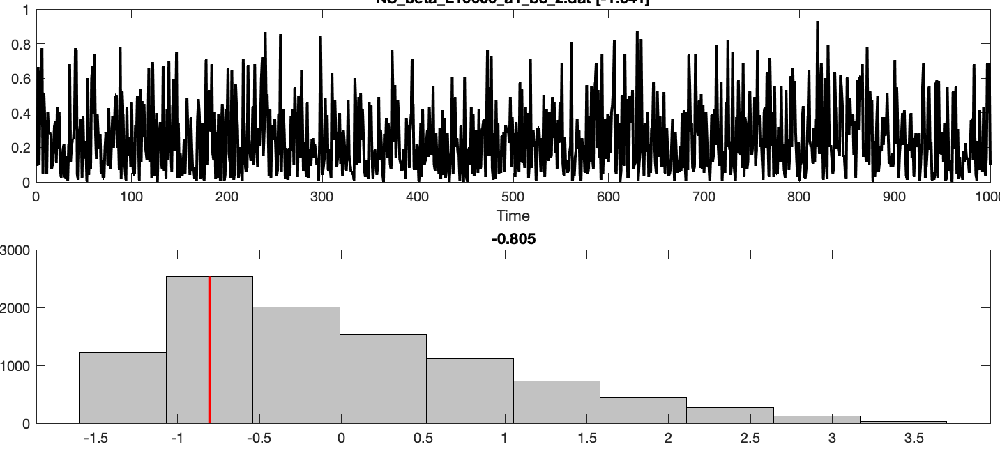

# The DN\_OutlierInclude Features

_catch22_ contains two features involving the `DN_OutlierInclude` function in  _hctsa:_

* `DN_OutlierInclude_p_001_mdrmd`
* `DN_OutlierInclude_n_001_mdrmd`

### What it does

These features involve the following steps:

1. _z_-score the input time series.
2. Initialize an equally spaced set of increments, from zero to the maximum value of the time series, in the case of `DN_OutlierInclude_p_001_mdrmd` \(or from 0 to the minimum value of the time series in the case of `DN_OutlierInclude_n_001_mdrmd`\). In this way, a set of increasingly 'extreme' deviations from the mean \(either deviations above-the-mean or below-the-mean\) are analyzed across the loop in Step \(3\).
3. At each threshold set in Step \(2\):
   1. Determine the time points in which the time series is 'over-threshold'.
   2. Compute the median index of all such over-threshold time points, as `rmd` .
   3. For interpretation, and to appropriately compare time series of different lengths, we then linearly re-scale `rmd` such that a median right in the middle of the time series, at index `N/2`, maps to 0, a value at the end of the time series, at index `N`, maps to 1, and a value at the start of the time series, index `1`, maps to a -1.
4. The final statistic returns the median of all values of `rmd` values across all values of the threshold, as the output statistic.

### What it measures

These statistics measure whether over-threshold events \(either positive or negative deviations from the mean\) tend to be positioned relative near the start of the time series \(output values near -1\), approximately equally likely to be anywhere through the time series \(output values near 0\), or more likely to be near the end of the time series \(output values near 1\). These features thus capture something related to the stationarity of over-threshold events.

To give an intuition, below we plot some examples of how `rmd` at a fixed threshold \(80% the maximum positive deviation\) for the case of `DN_OutlierInclude_p_001_mdrmd`. \(But note that the full statistic takes the median of `rmd`across a range of thresholds, as described above\).

* Time series, that have extreme events distributed similarly across time, will yield values close to zero for this statistic. For example these:

* Time series like these, for which large deviations from the mean tend to occur nearer to the end of the time series, will have values closer to 1:

* And time series like these, for which large deviations from the mean tend to occur nearer the start of the time series, will have values nearer to -1:

